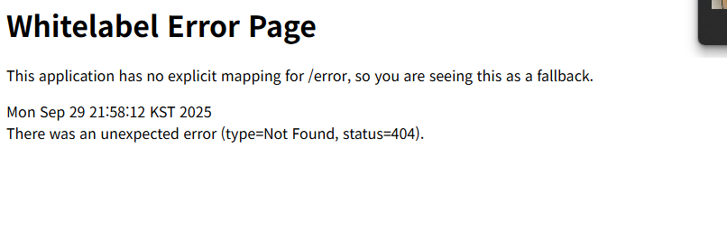

웹: 인터넷 위에서 동작하는 서비스 중 하나

HTTP: 웹에서 데이터를 주고 받는 서버 클라이언트 모델의 프로토콜

주요 메소드: GET, POST, PUT, PATCH, DELETE

데이터베이스: 데이터를 체계적으로 모아둔 저장소

API: 한 프로그램이나 다른 프로그램의 기능이나 데이터를 사용할 수 있도록 미리 정해놓은 약속

REST: 네트워크 아키텍처 스타일

--------------
1. 상품 정보 등록  
    HTTP Method : POST  
    URI : /item  
2. 상품 목록 조회  
   HTTP Method : GET
   URI : /item  
3. 개별 상품 정보 상세 조회  
   HTTP Method : GET  
   URI : /item/{id}  
4. 상품 정보 수정  
   HTTP Method : PATHCH  
   URI : /item/{id}  
5. 상품 삭제  
   HTTP Method : DELETE  
   URI : /item/{id}  

--------------
1. 주문 정보 생성  
   HTTP Method : POST  
   URI : /order  
2. 주문 목록 조회  
   HTTP Method : GET  
   URI : /order  
3. 개별 주문 정보 상세 조회  
   HTTP Method : GET  
   URI : /order/{id}  
4. 주문 취소  
   HTTP Method : DELETE  
   URI : /order/{id}  